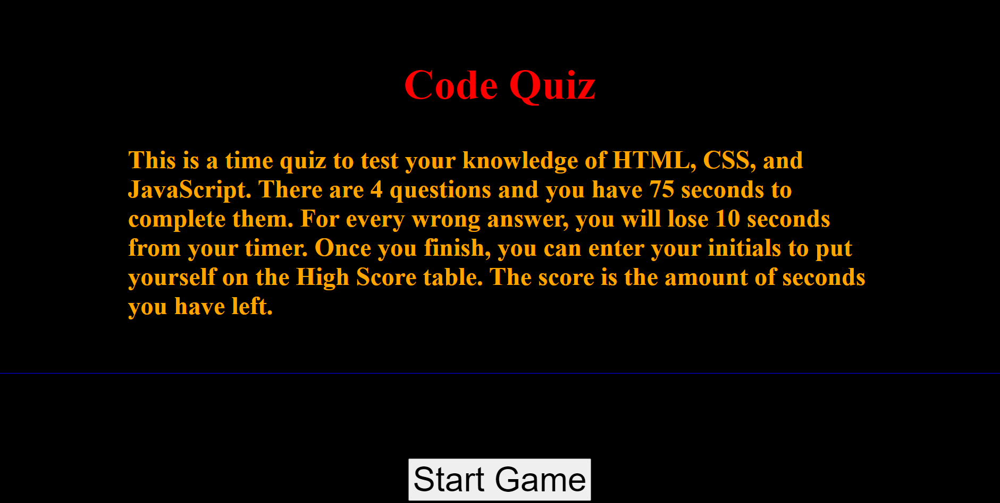

# 04 Web APIs: Code Quiz

## Task

The task was to create a code related quiz. The entire thing was to be created from scratch and certain acceptance criteria were given for the project to be considered successful. 

## Acceptance Criteria

```
GIVEN I am taking a code quiz
WHEN I click the start button
THEN a timer starts and I am presented with a question
WHEN I answer a question
THEN I am presented with another question
WHEN I answer a question incorrectly
THEN time is subtracted from the clock
WHEN all questions are answered or the timer reaches 0
THEN the game is over
WHEN the game is over
THEN I can save my initials and my score
```

## The Quiz

The quiz was created using 4 questions related to HTML/CSS/JS. Once the user starts the quiz, they have 75 seconds to complete it. For ever wrong answer, 10 seconds is removed from the timer. Once all questions are answered or if the timer runs out, the user is directed to a seperate page to submit their scores and initials. The score is the amount of time left. Once the user submits their scores, they are then redirected to the score page which lists all the scores of the previous attempts as well. These scores are stored in local storage/

## Submission
 
 The URL: https://anaeem23.github.io/Northwestern_BootCamp-04-Homework/

 Screenshot: 

